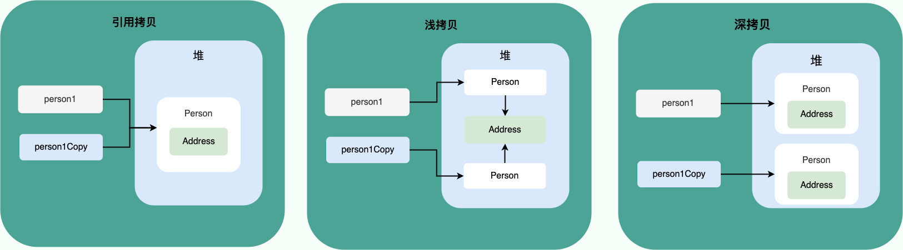

# ☕ Java

## JavaSE

### 基础部分

#### 基本数据类型

<table data-full-width="false"><thead><tr><th width="154">基本类型</th><th width="187" data-type="number">字节（byte）</th><th width="164" data-type="number">位数</th><th>默认值</th></tr></thead><tbody><tr><td>byte</td><td>1</td><td>8</td><td>0</td></tr><tr><td>short</td><td>2</td><td>16</td><td>0</td></tr><tr><td>int</td><td>4</td><td>32</td><td>0</td></tr><tr><td>long </td><td>8</td><td>64</td><td>0L</td></tr><tr><td>float</td><td>4</td><td>32</td><td>0f</td></tr><tr><td>double</td><td>8</td><td>64</td><td>0d</td></tr><tr><td>char</td><td>2</td><td>16</td><td>'u0000'</td></tr><tr><td>boolean</td><td>null</td><td>1</td><td>false</td></tr></tbody></table>

> :brain: 速记：int 和 float 都是占 4个字节，long 和 double 都是占 8个字节

:warning: 注意：基本数据类型的存储位置取决于作用域，<mark style="color:red;">局部变量存储在栈中，成员变量存储于堆中</mark>。

#### 自动拆\装箱

<mark style="color:blue;">拆\装箱</mark>是为了方便基本类型与包装类型之间的转换。例如：

```java
Integer i = 10; // 装箱（底层 => Integer.valueOf(10)）
int n = i; // 拆箱（底层 => i.intValue()）
```

:warning: 注意：在三元表达式中一定要注意类型的一致，不要一会儿基本类型一会儿包装类型，涉及到自动拆箱会有NPE的风险。例如：

```java
Integer i = null;
Boolean flag = false;
System.out.println(flag ? 0 : i); // 此处i的输出实际为“i.intValue()”，会报错NPE
// 正确写法： System.out.println(flag ? new Integer(0) : i);
```

#### 重载与重写的区别

<table><thead><tr><th width="145">区别项</th><th width="275">重载 (Overload)</th><th>重写 (Override)</th></tr></thead><tbody><tr><td>发生范围</td><td>同类中</td><td>子类中</td></tr><tr><td>参数列表</td><td>必须修改（类型\个数\顺序）</td><td>不可修改</td></tr><tr><td>返回类型</td><td>可修改</td><td>返回值类型 ≤ 父类原本的类型</td></tr><tr><td>异常</td><td>可修改</td><td>异常范围 ≤ 父类原本的异常</td></tr><tr><td>访问修饰符</td><td>可修改</td><td>严格程度 ≤ 父类原本的</td></tr><tr><td>发生阶段 <mark style="color:red;">*</mark></td><td>编译器</td><td>运行期</td></tr></tbody></table>

> :brain: 速记：
>
> * 重载 => 编译时多态，同类“<mark style="color:blue;">影分身</mark>”方法
> * 重写 => 运行时多态，子类“<mark style="color:green;">写轮眼</mark>”方法

:warning: 注意：构造方法不可以被重写，但是可以重载。

#### 引用相等 & 内容相等

通常我们使用 `==` 来进行地址的比较，`Object.equals()` 进行内容的比较，经典如下：

```java
String str1 = "hello";
String str2 = new String("hello");
String str3 = "hello";

System.out.println(str1 == str2); // false
System.out.println(str1 == str3); // true

System.out.println(str1.equals(str2)); // true
System.out.println(str1.equals(str3)); // true
```

#### 浅拷贝 & 深拷贝 & 引用拷贝

<figure><figcaption></figcaption></figure>

#### Object.hashCode() & Object.equals()

hashCode() 和 equals() 可以协作用于判断两个对象是否相等！

* 如果两个对象的 hashCode 值相等，它们不一定相等（哈希碰撞[^1]）
* 如果两个对象的 hashCode 值相等并且 equals() 方法也返回 true，才认为他们相等；
* 如果两个对象的 hashCode 值不相等，它们一定不相等。

:warning: 注意：老生常谈“**重写equals()时必须重写hashCode()方法**”，因为如果只重写了equals()，那会存在 「<mark style="color:orange;">明明equals()判断相等但实际两个对象的hashCode()不相等的矛盾场景</mark>」

#### String、StringBuffer、StringBuilder

| 对比角度     | String               | StringBuilder        | StringBuffer         |
| -------- | -------------------- | -------------------- | -------------------- |
| 可变性      | :x:                  | :white\_check\_mark: | :white\_check\_mark: |
| 线程安全性    | :white\_check\_mark: | :x:                  | :white\_check\_mark: |
| 性能（10分制） | 5分                   | 9分                   | 8分                   |

> StringBuffer 之所以线程安全，是因为内部对方法加了**同步锁**

:black\_nib: 总结：&#x20;

* 操作少量数据直接上 String
* 单线程操作字符串缓冲区下大数据量上 StringBuiler
* 多线程操作字符串缓冲区下大数据量上 StringBuffer


### 高级部分

#### Collections - 集合

#### Multithreading - 多线程

#### JVM - Java 虚拟机

#### Reflection - 反射

## Tips


[^1]: 所使用的哈希算法也许刚好会让多个对象传回相同的哈希值
